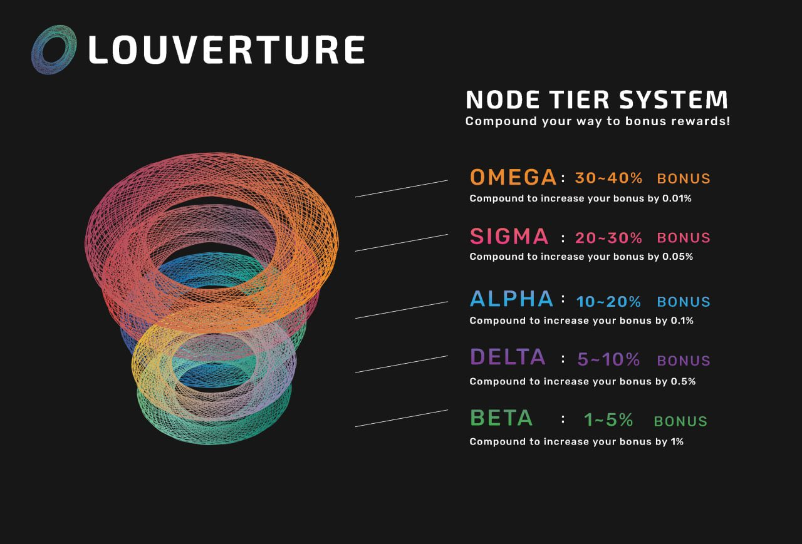

# 1.4 - Compounding & Tier system

To incentivize compounding, a multiplier is added on top of your node, and increases each time you compound. The rewards are based on the value of your node + your multiplier.\
\
You can claim any time, but have to wait 24 hours after compounding to compound again. You will get the effect of 6 compounding at once.\

The fees for the compounded rewards are the same as for nodes creation (70% to distribution pool / 20% to dev and marketing / 10% to LP)
